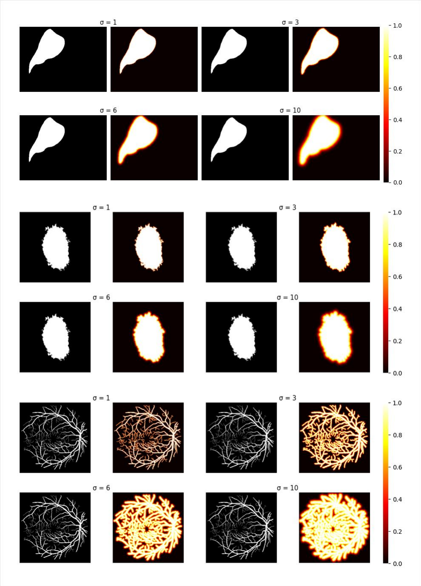
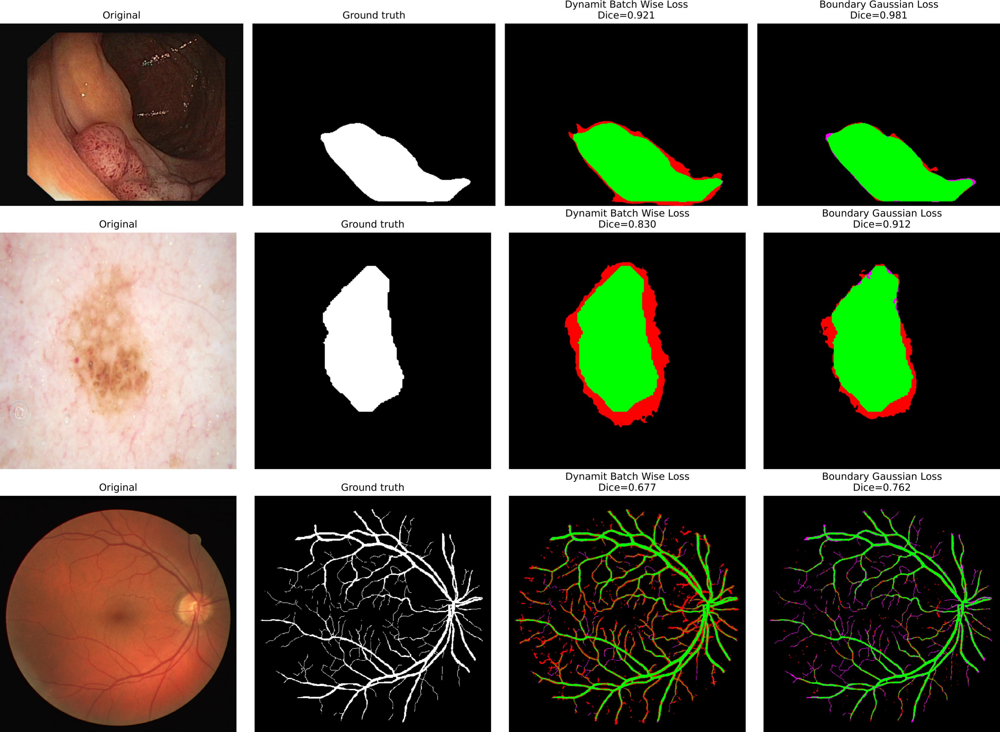
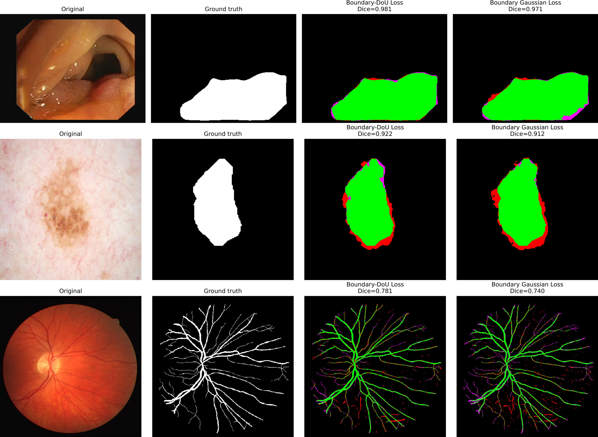

# Tackling-Class-Imbalance-in-Medical-Image-Segmentation
---

## Abstract
Medical image segmentation often suffers from strong class imbalance, as target structures occupy only a small portion of the image. This work explores loss function designs that combine class balancing and boundary awareness to improve segmentation accuracy and consistency. Building upon the Dynamit framework, we introduce the **Boundary Gaussian** and **Boundary–DoU** losses, which emphasize supervision near object borders. Experiments on **CVC-ClinicDB**, **DRIVE** and **ISIC 2018** demonstrate that the proposed methods achieve competitive accuracy across modalities.

---

### Dataset Overview
We evaluate our methods on three publicly available, **class-imbalanced** medical image segmentation datasets:
**CVC-ClinicDB** [[1]](#1), **DRIVE** [[2]](#2) and **ISIC 2018** [[3]](#3). 
All are **binary segmentation tasks** aiming to separate the target structure (polyp, vessel, or lesion) from the background.  
These datasets were selected to represent different segmentation challenges:
sharp-edged objects (**CVC**), thin elongated structures (**DRIVE**) and diffuse low-contrast boundaries (**ISIC 2018**).

---

### Boundary Gaussian Visualization
**Boundary weight maps for selected gaussian scales (σ = 1, 3, 6, 10).**  
This visualization illustrates the transition from sharp, localized edge emphasis to smoother, broadly diffused weighting.  
Shown for representative samples from the **CVC**, **ISIC**, and **DRIVE** datasets.
<p align="center">
  
</p>

---

### Qualitative Results
**Qualitative comparison of segmentation results using Dynamit Batch-wise, Boundary-Gaussian and Boundary-DoU losses.**  
Shown are representative predictions on the **CVC** (top), **ISIC** (middle) and **DRIVE** (bottom) validation sets.  
Green = *true positives*, Red = *false positives*, Magenta = *false negatives*.  
Dice scores are displayed for each example.

<p align="center">
  
</p>


<p align="center">
  
</p>

---

## Usage
Run training and evaluation with background execution using `nohup`:

```bash
# Training
nohup python -u -m src.engine.train --config configs/isic.yaml &
```
```bash
# Evaluation
nohup python -u -m src.engine.evaluate --config configs/isic.yaml &
```


### References
<a id="1"></a> [1] Bernal, J. *et al.* (2015). **WMDOVA: CVC-ClinicDB dataset for polyp segmentation.**  
<a id="2"></a> [2] Staal, J. *et al.* (2004). **Ridge-based vessel segmentation in color images of the retina.**  
<a id="3"></a> [3] Codella, N. *et al.* (2018). **Skin lesion analysis toward melanoma detection: The ISIC 2018 challenge.**
